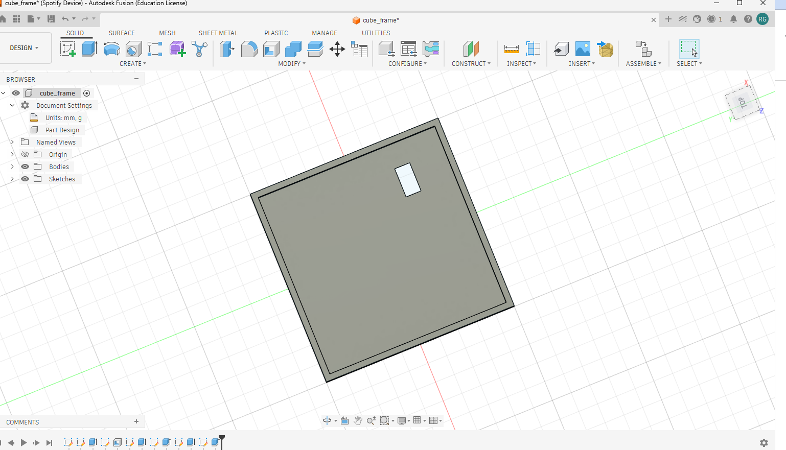

# interactive-led-cube

This is an interactive LED Cube that is powered by an ESP32. It has four rgb LED matrices that react to motion and sound using an MPU6050 IMU and a microphone sensor.
## Goal
Build a sensor-reactive RGB LED cube using an ESP32.

## Features
- RGB LEDs on 4 faces
- Sound reactivity
- Orientation tracking
- Real-time response under 500 ms

## Components
- ESP32
- WS2812B LED matrices
- MPU6050
- Microphone

## Firmware
The firmware is located in the firmware/ folder and is developed using PlatformIO and Arduino on the ESP32.

## Wiring Diagram

## Build Log

See docs/build_log.md for project progress and development history.

## CAD Render

